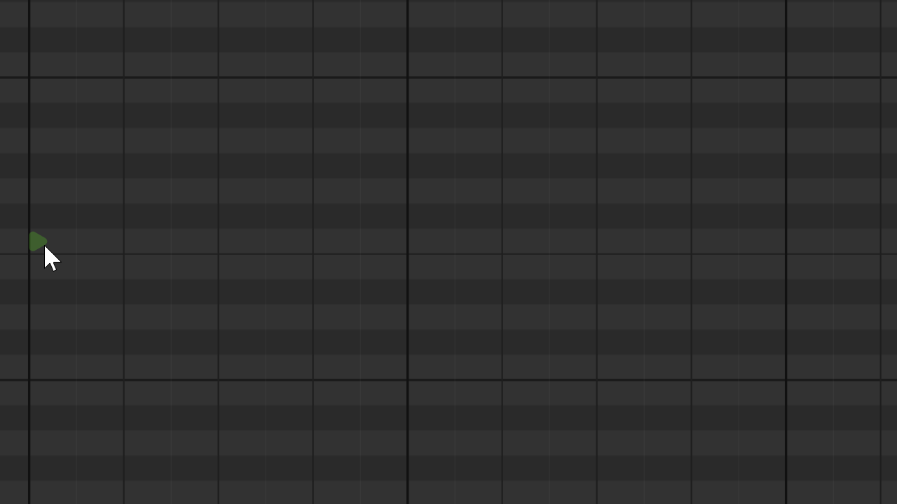
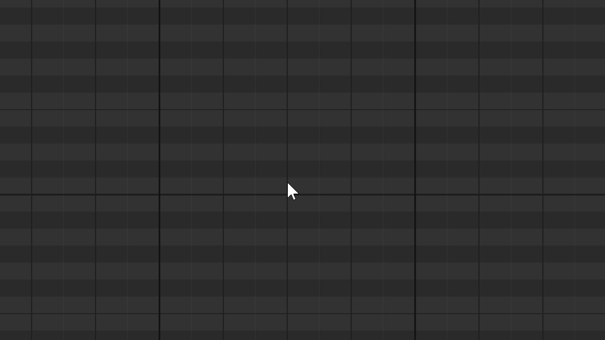

# A Better MIDI Editor / 一个更好的 MIDI 编辑器

A web-based MIDI editor focused on getting the interaction details right.

一个专注于把交互细节做好的网页版 MIDI 编辑器。

[](https://mofeil1.github.io/A-Better-MIDI-Editor/)

> `https://mofeil1.github.io/A-Better-MIDI-Editor/`

---

As a musician, I always felt like the tools in mainstream DAWs weren't quite there yet. I wanted to try building a better MIDI editor, so I started this project. Dark theme, editing interactions modeled after professional DAWs, and a few ideas of my own. Still a work in progress.

作为一名音乐人，我总觉得主流软件提供的编辑工具还不够完美。想试着做一个更好的 MIDI 编辑器，于是开了这个项目。深色主题、参考专业 DAW 设计的编辑交互，以及一些自己的想法。还在持续开发中。

## Features / 主要功能

### Flex Tool — A new way to input notes / Flex 工具 — 一种全新的音符输入方式



The Flex tool is the default tool. Click to place a note with auto-legato duration (extends to the next note automatically). The note head is a right-pointing triangle; the extension line shows the effective duration. Confirmed-duration notes have solid extension lines; auto-legato notes have semi-transparent ones.

Flex 工具是默认工具。点击放置音符，自动连奏时值（自动延伸到下一个音符）。音符头是向右的三角形，延长线显示有效时值。已确认时值的音符延长线实心，自动连奏的音符延长线半透明。

### Right-Click Tool Wheel / 右键工具轮盘



Hold right-click anywhere on the piano roll to open a radial tool picker. Flick the mouse in the direction of the tool you want and release. No need to look — pure muscle memory.

在钢琴卷帘任意位置按住右键打开径向工具选择轮盘。向目标工具方向甩鼠标松开即可。无需看屏幕，纯肌肉记忆。

### Other features / 其他功能

- Smart Snap — Zoom-adaptive grid, auto-adjusts resolution as you zoom (1/32 to whole bar).
- 智能吸附 — 缩放自适应网格，放大时自动变细、缩小时自动变粗。
- Alt+drag duplication — Copy notes Logic Pro style, ghost notes show move vs copy in real time.
- Alt+拖动复制音符 — Logic Pro 风格，原位 ghost 实时切换移动/复制样式。
- Velocity-colored notes with bidirectional hover highlight between note layer and velocity lane.
- 力度色谱音符，音符层和力度柱双向悬停联动高亮。
- Gesture-based undo — Every drag gesture is one undo step, selection state included in history.
- 手势级撤销 — 每个拖拽手势一步撤销，选区状态纳入历史。
- Precise velocity editing — Top-grab only, relative drag, draw-order-aware hit testing, batch editing.
- 精确力度编辑 — 柱顶抓取，相对拖拽无跳变，绘制顺序感知碰撞检测，批量编辑。
- MIDI import/export with multi-track picker.
- 带轨道选择的 MIDI 导入导出。
- Interactive piano keyboard — Hold to audition, drag for glissando, click to select by pitch.
- 可交互钢琴键盘 — 按住试听，拖动刮奏，点击选中同音高音符。
- Modifier tool switching — Ctrl/Cmd temporarily switches to Pointer in Flex/Pencil modes.
- 修饰键临时工具切换 — Ctrl/Cmd 在 Flex/Pencil 模式下临时切换为指针。
- Duration presets — Q/W/E/R/T to set note duration (whole to sixteenth), also applies to selected notes.
- 时值预设 — Q/W/E/R/T 设置音符时值（全音符到十六分音符），同时应用到选中音符。

## Shortcuts / 快捷键

| Key / 按键 | Action / 功能 |
|-----|--------|
| Space 空格 | Play / Stop 播放/停止 |
| 1 / 2 / 3 | Pointer / Flex / Pencil 指针/Flex/画笔 |
| Right-click hold 右键按住 | Tool wheel 工具轮盘 |
| Q / W / E / R / T | Duration preset: whole / half / quarter / eighth / sixteenth 时值预设 |
| Enter | Confirm duration (auto-legato to fixed) 确认时值 |
| . (Period) | Clear duration (fixed to auto-legato) 清除时值 |
| Ctrl/Cmd+Z | Undo 撤销 |
| Ctrl/Cmd+Shift+Z / Ctrl+Y | Redo 重做 |
| Ctrl/Cmd+C / V | Copy / Paste at playhead 复制/粘贴 |
| Ctrl/Cmd+A | Select all 全选 |
| Delete / Backspace | Delete selected 删除选中 |
| Escape | Clear selection 清除选区 |
| Shift+Click 单击 | Add to selection 加选 |
| Arrow keys 方向键 | Move selected notes (left/right by snap, up/down by semitone) 移动选中音符 |
| Shift+Up/Down 上/下 | Move selected notes by octave 移动选中音符一个八度 |
| Alt+Drag 拖动 | Duplicate notes 复制音符 |
| Middle mouse hold 鼠标中键按住 | Joystick pan 摇杆式平移 |
| Ctrl+Scroll 滚轮 | Zoom (centered on playhead) 缩放 |
| Shift+Scroll 滚轮 | Horizontal scroll 水平滚动 |
| Scroll 滚轮 | Vertical scroll 垂直滚动 |

## Note Interaction Zones / 音符交互区域

Each note has distinct interaction zones depending on its duration state:

| Zone | Confirmed duration | Auto-legato (null duration) |
|------|-------------------|---------------------------|
| Triangle head 三角形头 | Trim start (drag to change start position) 裁剪开头 | Move (drag to change pitch + position) 移动 |
| Extension line body 延长线中段 | Move 移动 | Transparent in Flex tool (draw through) Flex 工具下透明 |
| Extension line end 延长线尾部 | Resize (drag to change duration) 调整时值 | Resize 调整时值 |

## Tech / 技术栈

React 18, TypeScript, Vite, Zustand, Tone.js, Canvas. No backend.

## Planned / 计划中

- Chord grouping — select notes and group them into a named chord object with degree labels / 和弦编组
- Voicing transforms — apply drop-2, rootless, voice leading to grouped chords / Voicing 变换
- Key detection and scale degree display / 调性检测与音阶级数显示
- Chord track with Roman numeral analysis / 和弦轨道与罗马数字分析

## Future Outlook / 未来展望

- **Rule-Based Arpeggio & Accompaniment / 基于规则的琶音与伴奏生成** — Define rhythm patterns and pitch rules to automatically expand chords into arpeggios and accompaniment figures. Built-in presets (Alberti bass, broken chords, etc.) with full custom rule support. Deterministic and fully controllable — no black boxes.

- **Melody Analysis & Variation Management / 旋律分析与变奏管理** — Automatic motif and phrase structure recognition. A variation tree that lets you save multiple versions of the same passage and switch between them for comparison. Built-in transformation helpers: inversion, retrograde, rhythmic augmentation/diminution, and more.

> **No Generative AI / 不包含生成式 AI 功能** — This project does not include and will never incorporate generative AI features. We will never use unauthorized music from others in development. This is a tool that empowers creators — not one that replaces them.
>
> 本项目不包含、未来也不会加入生成式人工智能功能。制作过程中绝不使用未经授权的他人音乐。这是一个赋能创作者的工具，而不是替代创作者的工具。

## Run locally / 本地运行

```bash
npm install
npm run dev
```

## License

Copyright (c) 2026 Mofei Li (MofeiL1). All rights reserved.

You may use this software freely to create music — any music you make is entirely yours. However, the source code, software design, and UI/UX concepts may not be used, copied, modified, or distributed for any commercial purpose without explicit permission from the author.

你可以自由使用本软件创作音乐——你做的音乐完全属于你。但本项目的源代码、软件设计和交互设计不得以任何形式用于商业目的，除非获得作者的明确许可。
